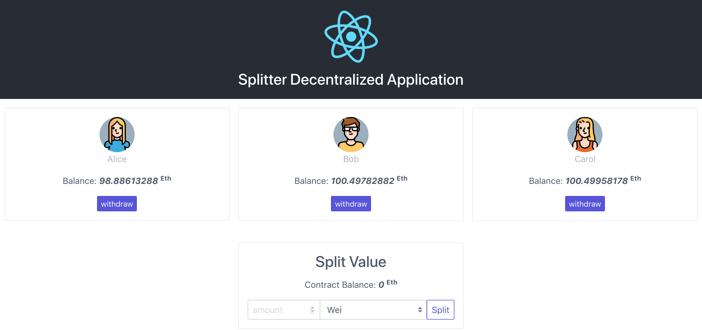

# splitter




## Install

```sh
$ yarn install
```

## TestRPC

```sh
$ yarn run ganache
```

## Tests

> Before running tests, make sure you are already running **TestRPC**.

```sh
$ yarn test
```

## DApp

> Before running DApp, make sure you are already running **TestRPC**.

```sh
$ yarn start
```

## LICENSE

MIT © [Peng Jie](https://github.com/neighborhood999/)
